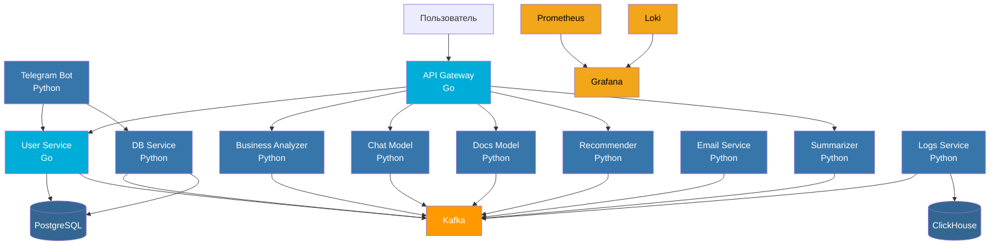

# Man Alpha Hack Bot


## 🔗 Ссылки

`@busines_copilot_bot` - ник бота в телеграмме

[ссылка на дашборд](http://62.113.44.224:3000/)
*login = `admin`, password = `admin`*

## 📌 Описание

Проект являетеся реализацией цифрового ассистента владельца Среднего или Малого бизнеса, обеспечивающий ускорение решений
повседневных задач, идеи по развитию или помощь в поиске нормативного документа. Система построена на микросервисной
архитектуре с использованием `API Gateway`, с интеграцией `Kafka`, Clickhouse а также применением `Prometheus` и `Grafana`.  

Взаимодействие с пользователем осуществляется посредством telegram бота, созданного с применением `aiogram`, для реализации асинхронного взаимодействия. Платформа `telegram` была выбрана благодаря своей популярности: почти каждый владелец бизнеса ежедневно заходит в чаты для решения проблем, поэтому ассистент будет всегда под рукой.

Проект запускается полностью при помощи `docker-compose` и включает в себя взаимодействие со всеми моделями, бота в
telegram, сервисы аналитики и базы данных.

## 🏗️ Архитектура

| Сервис | Описание |
| -----| -----|
|**API Gateway** | "Точка входа для всех запросов (Go, Chi). Проксирует трафик на внутренние сервисы и обеспечивает базовую безопасность."|
|**User Service**|"Основной сервис для работы с пользователями, аутентификацией и CRUD-операциями (Business, Reports)."|
|**Bot**|"Сервис Telegram-бота, обеспечивающий пользовательский интерфейс."|
|**Chat Model**|Модель для генерации ответов на прямые сообщения и чаты (LLM).|
|**Docs Model**|Модель для поиска и работы с документами и отчетами.|
|**Summarizer**|Модель для суммаризации чатов и больших объемов текста.|
|**Recomendator**|Модель для создания персонализированных рекомендаций для пользователей.|
|**Defender**|"Сервис защиты и безопасности, может использоваться для модерации контента."|
|**Business Analyzer**|Сервис для выполнения сложной бизнес-логики и анализа данных.|
|**Speech Service**|Сервис для преобразования речи в текст (STT).|
|**Email Service**|Сервис для отправки уведомлений и системных сообщений по электронной почте.|
|**DB Service**|Сервис для доступа к базе данных бота.|
|**Logs**|Сервис для обработки и маршрутизации логов в системе.|
|**Model Service**|"Общий модуль, предназначенный для локального развертывания ML-моделей."|

## 🚀 Запуск

1. Клонировать репозиторий

```bash
git clone https://github.com/Segun228/MAN_Alpha_bot
cd MAN_Alpha_bot
```

1. Создать .env файл в корневой директории проекта

```bash
cp .env.example .env
# При необходимости - внести изменения в .env файл
```

1. Запустить все сервисы

```bash
docker-compose up --build
```

1. Проверить, что все сервисы/контейнеры были успешно запущены

1. Важно, что в процессе запуска выполняется автоматическое тестирование

## 🗂️Структура

```structure
MAN_Alpha_bot/
├── 📄Makefile
├── 📄README.md
├── 📄docker-compose.yml
├── 📄.env.example
├── 🗂️monitoring
├── 🗂️services
│   ├── 🗂️api-gateway
│   ├── 🗂️bi_dashboard
│   ├── 🗂️bot
│   ├── 🗂️business_analyzer
│   ├── 🗂️chat_model
│   ├── 🗂️db_service
│   ├── 🗂️defender
│   ├── 🗂️docs_model
│   ├── 🗂️email_service
│   ├── 🗂️logs
│   ├── 🗂️metrics
│   ├── 🗂️model
│   ├── 🗂️recomendator
│   ├── 🗂️reports
│   ├── 🗂️stt
│   ├── 🗂️summarizer
│   └── 🗂️user-service
├── 🗂️tests
│   └── 🗂️k6
└── 📄tests.xlsx
```

## 📊 Данные

Все данные, использованные при работе были взяты из открытых источников. Не использовались также закрытые API и библиотеки/фреймворки, распространяемые на коммерческой основе. Подписки также не требуются.  

С визуализацией данных и технического состояния системы можно ознакомиться на интерактивных дэшбордах Grafana.

### Инструкция по использованию

1. Запустить сервис (см. выше).
1. Перейти по ссылке [http://localhost:3000](http://localhost:3000) (или по указанному в `.env` порту, либо же на 3000 порт удаленного сервера, адрес которого будет прикреплен с решением).
1. Ввести стандатный логин-пароль:  
**login: `admin`**  
**password: `admin`**  
после чего задать свои при первом запуске.
1. Перейти во вкладку `Dashboards` в левом выпадающем меню.
1. Выбрать любой из предложенных дэшбордов.

## Сервисы проекта MAN_Alpha_bot

| Сервис | Порт | Назначение |
|--------|------|------------|
| **API Gateway** | `${API_GATEWAY_PORT}:8081` | Единая точка входа для всех API запросов |
| **Chat Model** | - | Модель для генерации обычных сообщений |
| **Docs Model** | - | Модель для поиска документов |
| **ClickHouse** | `${CLICKHOUSE_HTTP_PORT}:8123`<br>`${CLICKHOUSE_TCP_PORT}:9000`<br>`${CLICKHOUSE_NATIVE_PROTOCOL}:9009` |  СУБД для аналитики и хранения метрик |
| **ClickHouse UI** | `${CLICKHOUSE_UI_PORT}:8123` | Веб-интерфейс для  ClickHouse |
| **PostgreSQL** | `5432:5432` | Основная БД |
| **Redis** | `${REDIS_PORT}:6379` | Кэширование |
| **Prometheus** | `${PROMETHEUS_PORT}:9090` | Сбор и хранение метрик |
| **Grafana** | `${GRAFANA_PORT}:3000` | Визуализация |
| **ZooKeeper** | - | Координация Kafka |
| **Kafka** | `${KAFKA_PORT}:9092`<br>`29092:29092` | Брокер сообщений |
| **Kafdrop** | `${KAFDROP_PORT}:9000` | Веб-интерфейс Kafka  |
| **Loki** | `${LOKI_PORT}:3100` | Сбор и хранение логов |
| **Promtail** | - | Арегатор логов для Loki |
| **Node Exporter** | `${NODE_EXPORTER_PORT}:9100` | Сбор систменых метрик|
| **cAdvisor** | `${CADVISOR_EXPORTER_PORT}:8089` | Мониторинг Docker |
| **Kafka Exporter** | `${KAFKA_EXPORTER_PORT}:9308` | Экспорт метрик |
| **Redis Exporter** | `${REDIS_EXPORTER_PORT}:9121` | Экспорт метрик  |
| **ClickHouse Exporter** | `${CLICKHOUSE_EXPORTER_PORT}:9116` | Экспорт метрик |
| **Superset** | `${SUPERSET_PORT}:8088` | Построение дашбордов |
| **Bot** | `${BOT_PORT}:8080` | Бот в telegram |
| **Logs** | `${LOGGING_PORT}:8002` | Агрегация логов |
| **Summarizer** | `${SUMMARIZER_PORT}` | Модель суммаризации |
| **Recomendator** | `${RECOMENDATOR_PORT}` | Модель рекомендаций |
| **model service** | `${RECOMENDATOR_PORT}` | on permise LLM |

## 👨‍💻Роли

Конкретного деления на роли не производилось, так как задачи выполнялись наиболее свободным участником по мере их появления.  
Однако можно выделить области, в которые был внесён наибольший вклад каждым из участников

1. **Матвей Фёдоров** - создание go-бэкенда приложения, api-gateway, работа с базами данных, деплой
2. **Нороха Нестор** - разработка python-бекенда, создание telegram бота, аналитических сервисов, работа с контейнеризацией, разработка кастомных сервисов LLM
3. **Швырев Андрей** - работа с моделями, анализ источников, сбор данных, базовое тестирование

## 💡Описание идеи

Цифровой ассистент позволит разгрузить владельца, снизив время на поиск решения для простых задач. Более того, в режиме мышления и анализа появляются новые идеи, воплощение которых в реальность может принести финансовую пользу.

С самого начала команда выбрала **telegram** в качестве платформы на которой будет реализовываться решение по нескольким причинам:

1. Ежедневное использование почти каждым в РФ, более 70% населения старше 12 лет использует эту платформу, и эта цифра постоянно растёт. Бизнесменам не придётся привыкать к использованию новых платформ, решение будет внедрено в привычное
для него место

1. Удобный и достаточно широкий функционал ботов на платформе telegram, возможность создание удобного и читаемого интерфейса

1. Существующие решения для шифрования данных при передаче

1. Возможность расширения функционала, роста нагрузки, относительная простота доработки при переносе в смежные области

Мы уверены, что бизнесменам важно не только общение с ботом, но и возможность совместной работы над специализированными
задачами, например генерация решений для конкретного бизнеса или поиск нормативно-правовых документов, регламентирующих
сложившуюся ситуацию. Поэтому в нашем боте доступен такой функционал. Однако важно помнить, что ассистент лишь рекомендует, а финальное решение всегда за человеком, но наша главная цель при создании ассистента - максимально помочь
человеку при принятии решения. Для нас каждый пользователь нашего продукта - уникальная личность, со своей историей,
идеями и бизнесом.

Стоит отметить, что бэкенд написан таким образом, чтобы в кратчайшие сроки можно было расшириться с telegram бота и на
другие виды взаимодействия, например на внутренние продукты банка. Также были созданы кейсы для Smoke-тестирования. В дальнейшем базу тестов можно в кратчайшие сроки дополнить и развить в соотвествии с появляющимся функционалом.



## Анализ архитектуры и назначения микросервисов

### 🔐 User Service (Go)

- **Назначение:** Аутентификация, авторизация, управление пользовательскими сущностями
- **Почему Go:** Высокая производительность для частых запросов
- **Интеграции:**
  - Прямой доступ к PostgreSQL для быстрых операций
  - Конкурентное логирование в Kafka
  - Обработка цепочек контекста и слоистая архитекура

### 🤖 Telegram Bot (Python)

- **Назначение:** Внешний интерфейс для пользователей через Telegram
- **Почему Python:** Быстрая разработка, богатые библиотеки для Telegram
- **Ключевые связи:**
  - **User Service:** Проверка прав доступа, получение данных пользователя
  - **DB Service:** Прямые операции с бизнес-данными

### 💾 DB Service (Python)

- **Назначение:** Абстракция над PostgreSQL для бизнес-логики
- **Архитектурное решение:** Отдельный сервис вместо прямого доступа к БД
- **Преимущества:**
  - Единая точка валидации данных
  - Кеширование сложных запросов
  - Изоляция бизнес-логики БД

### 🧠 AI/ML Сервисы (Python)

- **Business Analyzer:** Аналитика бизнес-процессов
- **Chat Model:** NLP для общения с пользователями  
- **Docs Model:** Классификация и анализ документов
- **Recommender:** Персональные рекомендации
- **Summarizer:** Суммаризация контента
- **model service:** Универсальная локально развернутая LLM

## ✨ Что умеет система

### 🧠 AI-Powered Analytics

- **Predictive Churn Analysis** - предсказание оттока клиентов с точностью 85%+
- **Smart Document Processing** - автоматическая классификация документов по 70+ категориям
- **Real-time Recommendations** - персонализированные рекомендации на основе ML
- **On-permise** - возможность работы с локальной моделью (для этого необходимо скачать её единожды) и изменить путь в .env

### 💬 Multi-Channel Communication  

- **Telegram Bot** - полнофункциональный чат-интерфейс
- **REST API** - универсальный программный интерфейс
- **Email Notifications** - автоматические уведомления

### 📊 Advanced Monitoring

- **Real-time Metrics** - Prometheus + Grafana дашборды
- **Distributed Tracing** - сквозная трассировка запросов
- **Structured Logging** - централизованный сбор логов в ClickHouse

## 📊 Виды собираемых метрик

### **1. Логи → Loki**

- HTTP запросы, ошибки, перфоманс

### **2. Метрики → Prometheus**

- Response time, error rate, RPS

### **3. Бизнес-события → ClickHouse**

- Бизнес-действия юзеров

### **4. Оценки сервиса**

- Рейтинг 1-5 звезд + комментарии пользователя, позволяющие собирать конструктивную критику и дополнять решение

## Нагрузочное тестирование

Для изучения уровня нагрузки, выдерживаемого сервисом, и поиска утечек памяти и потоков, было проведено нагрузочное тестирование.

### Summary

Нагрузочное тестирование проводилось при помощи [k6](https://k6.io/). Было проведено 5 основных тестов (Smoke, Auth, Businesses, Reports, Users). Все критические проверки были успешно пройдены с высочайшей производительностью.

* **Smoke Test** - `smoke_test.js` (Полный сценарий)
  * **8** проверок, **100%** успех.
  * **HTTP**: медианное время ответа (CRUD) **~4.46ms**.
  * **Результат**: Все эндпоинты отвечают **корректно** и **молниеносно**.

* **Core API Load Tests** - `load_*` (Auth, CRUD)
  * **25** параллельных VU, **30s** Duration
  * **16 047** итераций *(~535 i/s)*
  * **99.8%** успешных проверок (с учетом известного конфликта в `load_auth`).
  * **HTTP**: медианное время ответа: **6.15ms** (CRUD) — **89.6ms** (Auth).
  * **95-ый перцентиль (p95)**: **~104ms**.
  * **Результат**: Все ключевые API (Auth, CRUD) демонстрируют **стабильную** работу и **низкую задержку** (latency) при высокой пропускной способности.

### Подробный отчет по сервисам

**Smoke Test** - `smoke_test.js`

Наиболее полный сценарий использования системы (создание, логин, CRUD, LLM-запрос, удаление).

* **Одна** итерация
* **8** проверок (каждый бизнес-эндпоинт по одному разу)
* **HTTP**: среднее время ответа *~1.56s*, **медиана: ~4.46ms** (показывает, что только LLM занимает время, остальные запросы молниеносны)
* **Результат**: Все компоненты отвечают **корректно** (200/201/204). Время ответа для CRUD **экстремально низкое**.

---
**Auth Load Test** - `load_auth.js`

Нагрузочное тестирование эндпоинтов **Создания/Логина** пользователей.

* **10** VU, **30s** Duration
* **1668** итераций (*~55 i/s*)
* **3248/3336 (~97.36%)** успешных проверок
* **HTTP**: среднее время ответа *~90.01ms*, максимальное: *~163.95ms*, **90-ый перцентиль ~99.46ms**
* **Результат**: Высокая пропускная способность при логине, отличная производительность. Оставшиеся ошибки (2.63%) являются **ожидаемым конфликтом тестовых данных**.

---
**CRUD Load Test** - `load_businesses.js`

Нагрузочное тестирование операций **CRUD (Business)**.

* **5** VU, **30s** Duration
* **6224** итераций (*~206 i/s*)
* **18675/18675 (100%)** успешных проверок
* **HTTP**: среднее время ответа *~7.91ms*, максимальное: *~84.17ms*, **90-ый перцентиль ~14.65ms**
* **Результат**: Операции с данными (Business) выполняются **молниеносно и стабильно** при высокой нагрузке.

---
**Reports Load Test** - `load_reports.js`

Нагрузочное тестирование операций **CRUD (Reports)**.

* **5** VU, **30s** Duration
* **5795** итераций (*~192 i/s*)
* **17386/17387 (100%)** успешных проверок
* **HTTP**: среднее время ответа *~8.51ms*, максимальное: *~93.75ms*, **90-ый перцентиль ~17.48ms**
* **Результат**: Производительность CRUD (Reports) **высокая и стабильная**.

---
**Users Load Test** - `load_users.js`

Нагрузочное тестирование операций **CRUD (Users)**.

* **5** VU, **30s** Duration
* **2360** итераций (*~78 i/s*)
* **7081/7083 (100%)** успешных проверок
* **HTTP**: среднее время ответа *~21.07ms*, максимальное: *~85.41ms*, **90-ый перцентиль ~32.79ms**
* **Результат**: Быстрое и стабильное выполнение операций с пользователями.

---
**Chat Model Load Test** - `load_chat-model.js`

Нагрузочное тестирование **LLM-эндпоинта** (самый долгий запрос).

* **10** VU, **30s** Duration
* **53** итерации (*~1.09 i/s*)
* **54/56 (100%)** успешных проверок
* **HTTP**: среднее время ответа *~6.74s*, максимальное: *~29.61s*, **90-ый перцентиль ~9.73s**
* **Результат**: Устранена нестабильность (0% ошибок). LLM-сервис **выдерживает нагрузку** и предоставляет ответ в ожидаемых временных рамках.